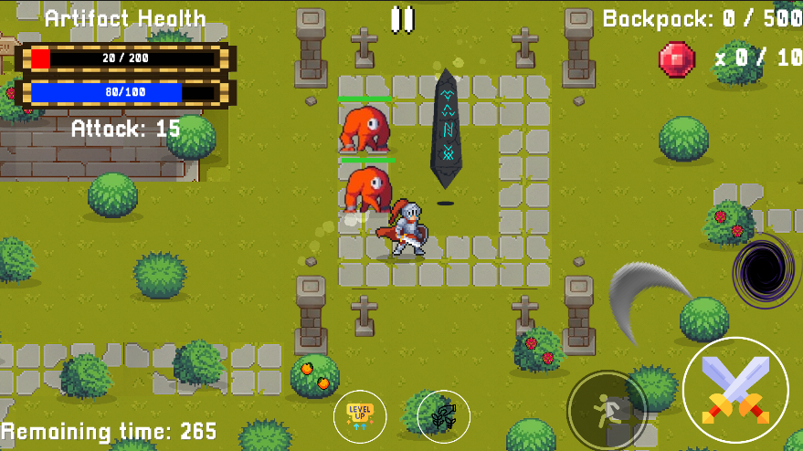
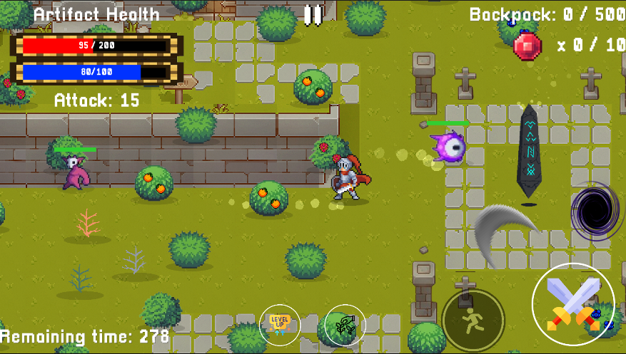

# Artifact

Simple 2D game focused in resource and time management!

Originaly made in **72 hours** for both **Ludum Dare 46** and **Torneo GJA round 1**; Theme "**Keep It Alive**"

| [:sparkles: Features](#code-and-features) | [:video_game: Play!](#play) | [:camera: Screenshots](#screenshots) |
| --------------- | -------- | ----------- |

## Code and features

- The game is currently built in **Unity 6.2 (6000.2.7f2)**
- All the code is documented with `
` tags so you can get a get a quick idea of the purpose of each component.

  
- Features **Scriptable Object** based simple localization system.
  
- Clone the repo straight away with `git clone https://github.com/hungnqse182498/Artifact-Defenders/tree/hungpd` and check the game in Unity by yourself
- The game's target platform is **WebGL** and it's designed to run in a **960x600** resolution, however it can be ported easily to Desktop and any resolution.

## Play

You can play the game right away at [itch.io](https://svartskogen.itch.io/artifact)!

## Screenshots

## License

MIT @ [duckhynh](https://github.com/hungnqse182498/Artifact-Defenders.git)
