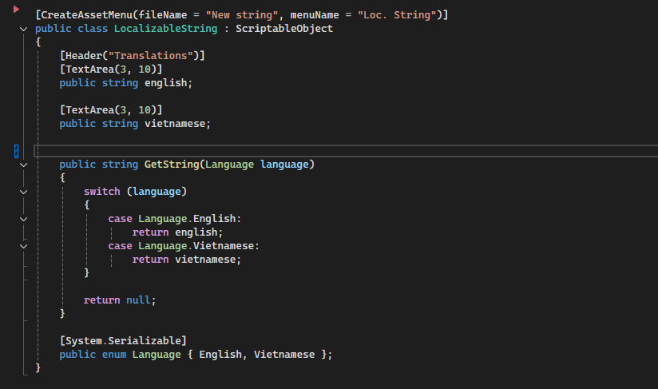

# Artifact 🎯

**Artifact** is a simple 2D game focused on **resource and time management**, created in **72 hours** for **Ludum Dare 46** and **Torneo GJA Round 1**.  
Theme: "**Keep It Alive**" 🕹️

---

 


---

## Table of Contents
- [Overview](#overview)
- [Features](#features)
- [Installation](#installation)
- [How to Play](#how-to-play)
- [Screenshots](#screenshots)
- [Project Structure](#project-structure)
- [Contributing](#contributing)
- [License](#license)

---

## Overview

Artifact is a lightweight 2D game where **every decision counts**.  
Manage resources, keep your environment alive, and survive as long as possible.  
Designed for **WebGL** at **960x600**, but fully compatible with Desktop and adjustable resolutions.

---

## Features

- **Scriptable Object-Based Architecture:** Simplifies data management and game logic.  
  
- **Localization Support:** Easily extendable with Scriptable Objects.  
  
- **Fully Documented Code:** Every component comes with `<summary>` tags for clarity.  
- **Cross-Platform Ready:** WebGL, Windows, MacOS, adjustable screen resolutions.  
- **Quick Start:** Clone, open in Unity, and play immediately.

---

## Installation

1. **Clone the repository**
```bash
git clone https://github.com/hungnqse182498/Artifact-Defenders/tree/hungpd
